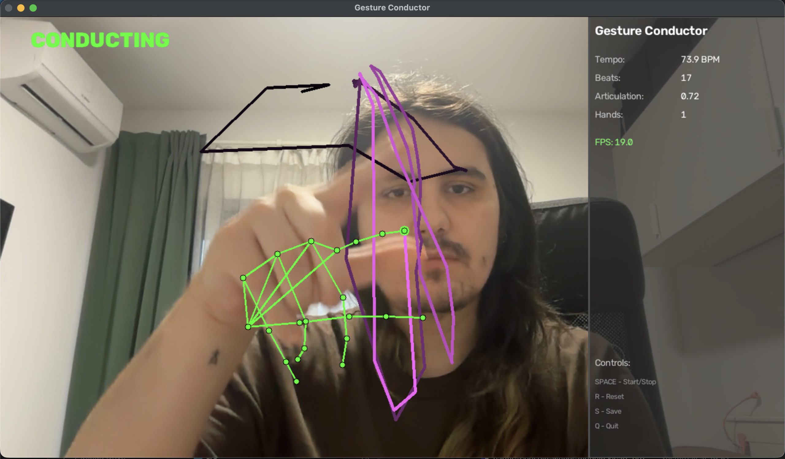
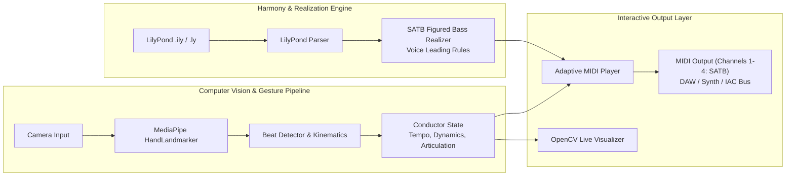

# Gesture Conductor

A real-time conducting gesture recognition and interactive accompaniment system. It detects conductor hand movements with computer vision (MediaPipe) and extracts tempo, dynamics, and articulation in real time to drive 4-part SATB figured bass harmonization via MIDI or live visualization.



---

## Features

- **Real-Time Conducting Tracking**: 3D hand tracking with trajectory visualization, velocity estimation, and beat prediction.
- **Dynamic Parameter Extraction**: Translates gesture speed and height into tempo (BPM), dynamics (MIDI velocity), and articulation (legato vs. staccato).
- **Figured Bass Realization Engine**: Parses LilyPond (`.ily`, `.ly`) figured bass notation and harmonizes SATB (Soprano, Alto, Tenor, Bass) chords following strict voice leading rules (avoiding parallel 5ths/8ths).
- **Interactive MIDI Accompaniment**: Conduct with your hand to advance through musical chords in real time, synchronizing the music to your tempo.
- **DAW & Hardware Routing**: Sends multi-channel MIDI over virtual ports (e.g. macOS IAC Driver) directly to DAWs (Ableton, Logic, Reaper) or software synths.
- **TidalCycles Live Coding Export**: Export realized progressions directly into TidalCycles format.

---

## Installation

### Prerequisites

- **Python**: 3.12+ (macOS Apple Silicon, Linux, or Windows)
- **Camera**: Built-in webcam or external USB camera
- **MIDI Setup** (Optional for MIDI playback):
  - macOS: Enable the built-in **IAC Driver** in *Audio MIDI Setup*
  - Windows: [loopMIDI](https://www.tobias-erichsen.de/software/loopmidi.html)
  - Linux: ALSA / Virtual RawMIDI

### Quick Setup with `uv` (Recommended)

```bash
# Clone repository
git clone https://github.com/speedypleath/conductor.git
cd conductor

# Create venv and install all dependencies
uv venv
source .venv/bin/activate  # Windows: .venv\Scripts\activate
uv pip install -e ".[dev]"
```

### Standard Setup with `pip`

```bash
python3 -m venv venv
source venv/bin/activate    # Windows: venv\Scripts\activate
pip install -e ".[dev]"
```

---

## Quick Start

### 1. Integrated Gesture Conductor + MIDI Accompaniment
Conduct a realized 4-voice figured bass progression with your hand:

```bash
# Run with default 16-bar figured bass piece (110 chords)
python main_conductor_midi.py

# Or specify a custom LilyPond piece
python main_conductor_midi.py examples/figured_bass_extended.ily

# Specify custom camera index if needed
python main_conductor_midi.py --camera 1
```

### 2. Standalone Conducting Visualizer
Run visual gesture tracking and tempo analysis without MIDI playback:

```bash
python main.py
```

### 3. Standalone Figured Bass Realization & Playback
Realize and listen to figured bass files without camera input:

```bash
# Real-time MIDI playback with fixed BPM and velocity
python scripts/play_figured_bass_midi.py examples/figured_bass.ily 120 80

# Analyze voice leading and print realized SATB chords
python scripts/realize_figured_bass.py examples/figured_bass.ily

# Export figured bass chords to TidalCycles pattern
python scripts/export_to_tidal.py examples/figured_bass.ily output.tidal
```

---

## Controls

| Key | Action |
|:---|:---|
| **SPACE** | Start / Pause conducting analysis & MIDI playback |
| **R** | Reset conductor state and rewind progression to the beginning |
| **C** | Clear gesture trails and motion history |
| **Q** | Quit application |

---

## How It Works & Architecture



### Musical Mapping
- **Beat Position**: Each downward/upward conducting bounce advances to the next chord in the progression.
- **Tempo**: Measured dynamically from beat intervals (30–240 BPM).
- **Dynamics**: Hand velocity and gesture range map to MIDI velocity (0–127).
- **Articulation**: Gesture sharpness adjusts note duration (legato vs. staccato).

### MIDI Channels
By default, the 4 SATB voices are mapped across MIDI channels:
- **Channel 1 (0)**: Soprano
- **Channel 2 (1)**: Alto
- **Channel 3 (2)**: Tenor
- **Channel 4 (3)**: Bass

---

## Project Structure

```
conductor/
├── assets/                       # Media and demo screenshots
│   └── demo.png
├── models/                       # MediaPipe vision models
│   └── hand_landmarker.task
├── examples/                     # Figured bass scores (.ily, .pdf)
│   ├── figured_bass.ily
│   ├── figured_bass_extended.ily
│   └── figured_bass_long.ily
├── src/
│   ├── gesture_conductor/        # Vision, kinematics & gesture detection
│   │   ├── detector.py           # MediaPipe hand tracker (GPU/Metal enabled)
│   │   ├── beat_detector.py      # Beat trajectory & tempo analyzer
│   │   ├── conductor.py          # High-level musical gesture analyzer
│   │   └── visualiser.py         # Real-time HUD & trajectory overlay
│   └── realization/              # Music theory, parsing & MIDI engine
│       ├── lilypond_parser.py    # Parser for LilyPond figured bass
│       ├── generator.py          # 4-part SATB voice leading realizer
│       ├── midi_communicator.py  # Low-level multi-channel MIDI output
│       ├── adaptive_midi_player.py # Tempo-synchronized MIDI sequencer
│       └── tidal_exporter.py     # TidalCycles pattern exporter
├── scripts/                      # Standalone CLI tools
│   ├── play_figured_bass_midi.py
│   ├── realize_figured_bass.py
│   └── export_to_tidal.py
├── tests/                        # Unit test suite
├── main.py                       # Vision analyzer entry point
├── main_conductor_midi.py        # Integrated gesture + MIDI application
├── pyproject.toml                # Project metadata & dependency definitions
└── README.md
```

---

## Development & Testing

Run unit tests:
```bash
pytest
```

Run linter & formatter:
```bash
ruff check .
black .
```

---

## License

MIT License - see [LICENSE](LICENSE) for details.

## Acknowledgments

- Built with [MediaPipe](https://mediapipe.dev/) for gesture analysis.
- Powered by [Mido](https://mido.readthedocs.io/) and [python-rtmidi](https://spotlightkid.github.io/python-rtmidi/) for low-latency MIDI.
- Computer vision rendering with [OpenCV](https://opencv.org/).